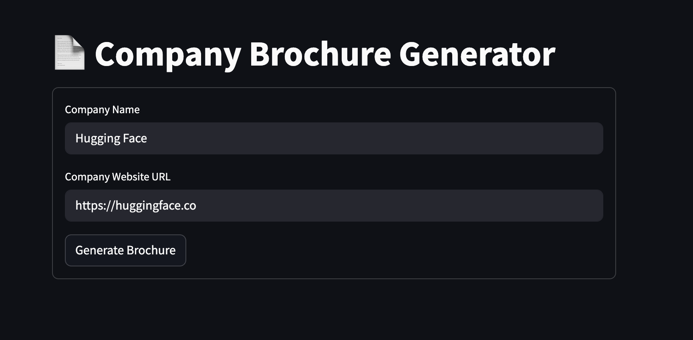

# Company Brochure Generator

Welcome to the **Company Brochure Generator**! This is an AI-powered, lightweight web application that creates professional brochures for companies by scraping their websites and using **OpenAI's GPT-4o-mini** model to generate and translate content — all through a clean and simple web interface.



## Table of Contents

- [Features](#features)
- [Tech Stack](#tech-stack)
- [Architecture](#architecture)
- [Installation](#installation)
- [Usage](#usage)

## Features

- **Automated Web Scraping**
  - Input a company name and its homepage URL.
  - The app scrapes the homepage, then uses **GPT-4o-mini** to identify and extract relevant internal links for deeper content.

- **Brochure Generation**
  - Uses **OpenAI GPT-4o-mini** to craft professional brochures based on scraped website content.
  - Sections include:
    - About Us
    - Our Team / Leadership
    - Why Choose Us
      
- **AI-Powered Translation**
  - Translates the generated brochure into a selected language using GPT-4o-mini.
  - Translated brochure is displayed side-by-side with the original.

- **Streamlit Web Interface**
  - Clean and responsive UI for seamless interaction.
  - Instant brochure generation and live language translation options.

## Tech Stack

- **Frontend/UI:** Streamlit  
- **Web Scraping:** BeautifulSoup, Requests  
- **AI Model:** OpenAI GPT-4o-mini (used for both generation and translation)  
- **Language:** Python 3.8+

## Architecture

Here's how the app works:

1. **User Input:** The user enters the company name and its homepage URL.
2. **Initial Scraping:** The app collects content from the homepage.
3. **Relevant Link Discovery:** GPT-4o-mini analyzes the homepage content and identifies relevant subpages (e.g., About, Services, Contact).
4. **Deep Scraping:** These subpages are scraped for detailed information.
5. **Prompt Construction:** Scraped data is structured into a prompt.
6. **Brochure Generation:** GPT-4o-mini generates the final brochure.
7. **Language Translation:** GPT-4o-mini translates the brochure to the user’s selected language.
8. **Output Display:** Both the original and translated versions are shown side-by-side in the UI.

## Installation

1. **Clone the repository**:

    ```bash
    git clone https://github.com/mohamedzeina/company-brochure-generator.git
    cd company-brochure-generator
    ```

2. **Create the Conda environment**  
   Requires [Anaconda](https://www.anaconda.com/) or [Miniconda](https://docs.conda.io/en/latest/miniconda.html):

    ```bash
    conda env create -f environment.yaml
    ```

3. **Activate the environment**

    ```bash
    conda activate brochure-gen
    ```

4. **Set your OpenAI API key**  
   Create a `.env` file in the project root with:

    ```
    OPENAI_API_KEY=your-api-key-here
    ```

5. **Run the Streamlit app**

    ```bash
    streamlit run brochureGen.py
    ```

## Usage

1. Launch the app in your browser.
2. Enter a company name and homepage URL.
3. Click **"Generate Brochure"**.
4. After brochure generates, select a language to translate the brochure and click **"Translate Brochure"**.
5. View the **original** and **translated** brochures side-by-side.
